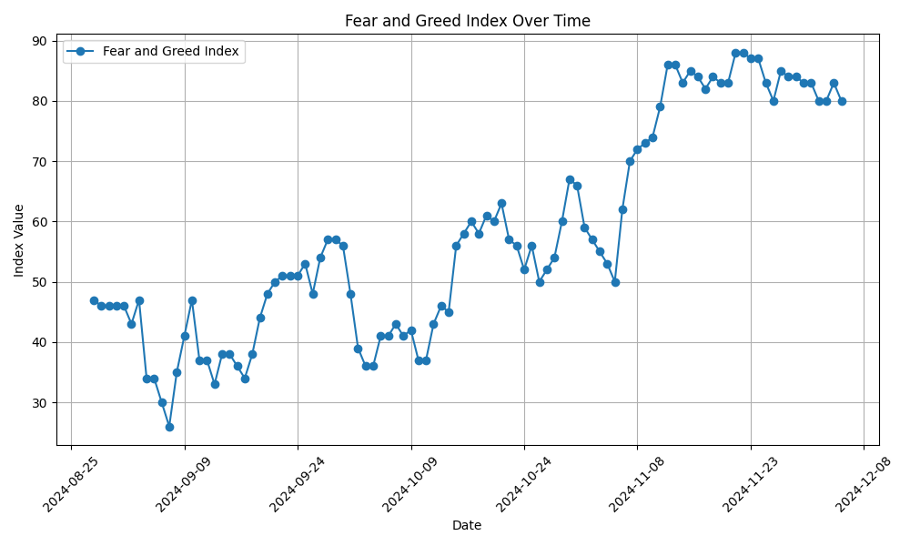

# Crypto Fear & Greed Analytics

Crypto Fear and Greed Analytics is a Python-based tool that fetches, processes, and visualizes historical **[Fear and Greed Index](https://coinmarketcap.com/charts/fear-and-greed-index/)** data from the [CoinMarketCap API](https://coinmarketcap.com/api/). This project enables you to analyze investor sentiment trends over time and derive meaningful insights.

---

## 🚀 Features

1. **Fetch Data from CoinMarketCap API**:
   - Automatically fetch historical Fear and Greed Index data using the CoinMarketCap API.

2. **Analyze Sentiment**:
   - Perform statistical analysis (max, min, mean) on the sentiment data.

3. **Visualize Trends**:
   - Generate interactive visualizations to track Fear and Greed Index trends over time.

4. **Export Processed Data**:
   - Save the processed data into CSV format for further analysis.

---

## 🛠️ Project Structure

```
Crypto-Fear-And-Greed-Analytics/
├── data/
│   ├── raw/                 # Stores raw JSON data
│   │   └── fear_greed.json
│   └── processed/           # Stores processed CSV data
│       └── fear_greed.csv
├── src/
│   ├── fetch_data.py        # Script to fetch and save raw data
│   ├── analyze_data.py      # Script to process data and export to CSV
│   ├── visualize_data.py    # Script to generate visualizations
│   └── config.py            # Contains the API key
├── requirements.txt         # Python dependencies
└── README.md                # Project documentation
```

---

## 🧑‍💻 Setup Instructions

### 1. Clone the Repository
```bash
git clone https://github.com/Vikranth3140/Crypto-Fear-And-Greed-Analytics.git
cd Crypto-Fear-And-Greed-Analytics
```

### 2. Install Dependencies
Install the required Python libraries:
```bash
pip install -r requirements.txt
```

### 3. Configure API Key
1. Sign up at [CoinMarketCap](https://coinmarketcap.com) and get your API key.
2. Add your API key to the `config/config.py` file:
   ```python
   API_KEY = "your_api_key_here"
   ```

---

## 📊 Usage

### 1. Fetch Raw Data
Run the `fetch_data.py` script to fetch historical Fear and Greed Index data from the CoinMarketCap API:
```bash
python src/fetch_data.py
```
This will save the raw data in `data/raw/fear_greed.json`.

---

### 2. Analyze and Export Data
Run the `analyze_data.py` script to process the raw data, calculate statistics, and save it to a CSV file:
```bash
python src/analyze_data.py
```
The processed data will be saved in `data/processed/fear_greed.csv`.

---

### 3. Visualize Data
Run the `visualize_data.py` script to generate a time-series plot of the Fear and Greed Index:
```bash
python src/visualize_data.py
```

---

## 📈 Example Output

### Visualization


### Statistics
```
Statistics: {'max_value': 88, 'min_value': 26, 'mean_value': 57.55}
```

---

## 📚 API Reference

### CoinMarketCap API: Fear and Greed Index

**Endpoint**:
```
GET https://pro-api.coinmarketcap.com/v3/fear-and-greed/historical
```

**Query Parameters**:
- `start` (optional): Starting timestamp for data retrieval.
- `limit` (optional): Number of records to retrieve (default: 50).

**Headers**:
```json
{
  "X-CMC_PRO_API_KEY": "your_api_key_here"
}
```

**Response Example**:
```json
{
  "status": {
    "timestamp": "2024-12-05T12:00:00.000Z",
    "error_code": 0,
    "error_message": null
  },
  "data": [
    { "timestamp": 1733356800, "value": 80, "value_classification": "Extreme Greed" },
    { "timestamp": 1733260400, "value": 83, "value_classification": "Extreme Greed" }
  ]
}
```

For more details, visit [CoinMarketCap API Documentation](https://coinmarketcap.com/api/).

---

## 🤝 Contributing
1. Fork the repository.
2. Create a feature branch: `git checkout -b feature-name`.
3. Commit your changes: `git commit -m "Add feature-name"`.
4. Push to the branch: `git push origin feature-name`.
5. Open a pull request.

---

## 📜 License
This project is licensed under the [MIT License](LICENSE).